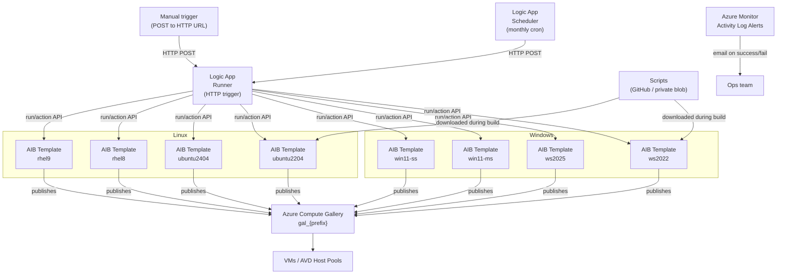

# Golden Image Builder for Azure

Fully automated golden image factory for Windows (Server + AVD) and Linux (Ubuntu + RHEL) using **Azure Image Builder**, **Azure Compute Gallery**, and **Logic Apps** — deployable in one click.

[](https://portal.azure.com/#create/Microsoft.Template/uri/https%3A%2F%2Fraw.githubusercontent.com%2Fsimon-vedder%2Fbicep%2Fadd%2Fgoldenimagebuilder%2Fautomations%2Fbuild-golden-image%2Fmain.json/createUIDefinitionUri/https%3A%2F%2Fraw.githubusercontent.com%2Fsimon-vedder%2Fbicep%2Fadd%2Fgoldenimagebuilder%2Fautomations%2Fbuild-golden-image%2FcreateUiDefinition.json)

---

## What is this?

Every time Microsoft releases updates, your VMs are at risk of running outdated base images. Manually maintaining golden images is error-prone and time-consuming. This solution automates the full lifecycle:

1. A Logic App fires on a monthly schedule (configurable, default: day 15 of each month ≈ 3 days after Patch Tuesday)
2. Azure Image Builder pulls the latest marketplace base image, runs your customization scripts, and publishes a new versioned image to an Azure Compute Gallery
3. Azure Monitor alerts notify you on success or failure via email
4. Any VM or AVD host pool can reference the gallery image definition — it always resolves to the latest version

You get a versioned, auditable, reproducible golden image pipeline with zero manual steps after initial deployment.

---

## Architecture



---

## What gets deployed

| Resource | Name pattern | Purpose |
|---|---|---|
| User-assigned MI | `uami-{prefix}-aib` | AIB identity — Contributor on RG |
| User-assigned MI | `uami-{prefix}-la` | Logic App identity — Contributor on RG |
| Azure Compute Gallery | `gal_{prefix}` | Stores and versions all golden images |
| Image definition (×n) | `imgdef-{prefix}-{os}` | One definition per enabled OS type |
| AIB Image Template (×n) | `aib-{prefix}-{os}` | Build config per enabled OS |
| Logic App | `la-{prefix}-runner` | HTTP trigger — POST to start an on-demand build cycle |
| Logic App | `la-{prefix}-scheduler` | Recurrence trigger — fires monthly on configured day/hour |
| Role assignments | (on RG) | Contributor for both UAMIs |
| Storage account *(optional)* | `stgib{prefix}` | Private script storage (if GitHub not reachable) |
| Log Analytics *(optional)* | `log-{prefix}-gib` | Centralized build log aggregation |
| Action Group *(optional)* | `ag-{prefix}-gib` | Email notification target |
| Activity Log Alerts *(optional)* | `alert-{prefix}-aib-*` | Fires on AIB success and failure |

---

## Supported OS images

### Windows

| Parameter | OS | Marketplace SKU | Use case |
|---|---|---|---|
| `enableWindowsServer2022` | Windows Server 2022 | `2022-datacenter-azure-edition` | IaaS VM workloads |
| `enableWindowsServer2025` | Windows Server 2025 | `2025-datacenter-azure-edition` | IaaS VM workloads |
| `enableWindows11MultiSession` | Windows 11 Multi-Session | `win11-24h2-avd` | AVD pooled session hosts |
| `enableWindows11SingleSession` | Windows 11 Single-Session | `win11-24h2-ent` | AVD personal hosts / standard VMs |

### Linux

| Parameter | OS | Marketplace SKU | Use case |
|---|---|---|---|
| `enableUbuntu2204` | Ubuntu 22.04 LTS | `22_04-lts-gen2` | IaaS VM workloads |
| `enableUbuntu2404` | Ubuntu 24.04 LTS | `server-gen2` | IaaS VM workloads |
| `enableRhel8` | RHEL 8 (PAYG) | `8-lvm-gen2` | IaaS VM workloads — RHEL license cost included |
| `enableRhel9` | RHEL 9 (PAYG) | `9-lvm-gen2` | IaaS VM workloads — RHEL license cost included |

> **Default:** Windows Server 2022, 2025, and Windows 11 Multi-Session are enabled. All Linux images are disabled by default.

---

## Prerequisites

Before deploying, ensure:

1. **Register the AIB resource provider** in the target subscription:
   ```bash
   az provider register --namespace Microsoft.VirtualMachineImages --wait
   az provider register --namespace Microsoft.Compute --wait
   az provider register --namespace Microsoft.KeyVault --wait
   az provider register --namespace Microsoft.Storage --wait
   ```

2. **Permissions** — the deploying identity needs at minimum:
   - `Contributor` on the target resource group
   - `User Access Administrator` on the target resource group (to create role assignments for the UAMIs)

3. **Azure Container Instance (ACI) quota** — Azure Image Builder uses ACI containers internally during each build. The optional private script storage module also uses a deployment script container. Each AIB build consumes ~3.8 Standard CPU cores simultaneously.

   | Images enabled | ACI StandardCores needed |
   |---|---|
   | 1 image | 3.8 cores |
   | 3 images (default) | 11.4 cores |
   | 8 images (all enabled) | 30.4 cores |

   The default ACI quota in most regions is **10 StandardCores**, which is not enough for the default 3-image configuration. **Request an increase before deploying:**

   Azure portal → Subscriptions → `[your subscription]` → Usage + quotas → search "Container Instances" → StandardCores → Request increase

   **Recommended:** set quota to at least `3.8 × (number of enabled OS images)`, rounded up — e.g. 20 cores for 5 images. Quota changes take effect within minutes.

4. **Subscription quota** — AIB uses `Standard_D4s_v3` VMs during builds (4 vCPUs each). Ensure you have vCPU quota for the number of parallel builds (one per enabled OS).

---

## Deploy to Azure (one-click)

> **Note:** The Deploy to Azure button requires a compiled ARM template (`main.json`). Compile it first:
> ```bash
> az bicep build --file automations/build-golden-image/main.bicep \
>                --outfile automations/build-golden-image/main.json
> ```
> Commit `main.json` alongside the Bicep source. The button uses the compiled file.

[](https://portal.azure.com/#create/Microsoft.Template/uri/https%3A%2F%2Fraw.githubusercontent.com%2Fsimon-vedder%2Fbicep%2Fadd%2Fgoldenimagebuilder%2Fautomations%2Fbuild-golden-image%2Fmain.json/createUIDefinitionUri/https%3A%2F%2Fraw.githubusercontent.com%2Fsimon-vedder%2Fbicep%2Fadd%2Fgoldenimagebuilder%2Fautomations%2Fbuild-golden-image%2FcreateUiDefinition.json)

The portal wizard walks through:
- **Image Selection** — Windows and Linux OS types to build (independent toggles)
- **Customization** — agents, security hardening, AVD optimizations (Win11 only)
- **Schedule & Notifications** — build day/hour, email alerts
- **Networking** — optional VNet injection, optional private script storage

---

## Manual deployment (Azure CLI)

```bash
# 1. Create a resource group
az group create \
  --name rg-golden-image-prod \
  --location westeurope

# 2. Deploy (Windows defaults — WS2022, WS2025, Win11 Multi-Session)
az deployment group create \
  --resource-group rg-golden-image-prod \
  --template-file automations/build-golden-image/main.bicep \
  --parameters namePrefix=gib-contoso-prod

# 3. Deploy with Linux images enabled alongside Windows defaults
az deployment group create \
  --resource-group rg-golden-image-prod \
  --template-file automations/build-golden-image/main.bicep \
  --parameters namePrefix=gib-contoso-prod \
               enableUbuntu2404=true \
               enableRhel9=true
```

For OS-specific deployments only:
```bash
# Windows only
--template-file automations/build-golden-image/windows/main.bicep

# Linux only
--template-file automations/build-golden-image/linux/main.bicep
```

---

## Post-deployment steps

### 1. Update script base URLs
If you forked this repo, update `windowsScriptBaseUrl` and `linuxScriptBaseUrl` to point to your fork's raw GitHub URLs, or use `usePrivateScriptStorage: true` to upload scripts to the deployed storage account automatically.

### 2. Trigger your first build
The scheduler runs automatically on the configured schedule. To trigger an immediate build:

```bash
# Get the runner trigger URL from deployment outputs
TRIGGER_URL=$(az deployment group show \
  --resource-group rg-golden-image-prod \
  --name main \
  --query properties.outputs.manualTriggerUrl.value \
  --output tsv)

# Trigger a full build cycle
curl -X POST "$TRIGGER_URL"
```

Or find it in the Azure portal: **Resource Group → Deployments → main → Outputs → manualTriggerUrl**

### 3. Monitor build progress
AIB builds take 30–90 minutes depending on updates and scripts. Monitor via:

```bash
# Check status of a specific image template
az image builder show \
  --name aib-gib-contoso-prod-ws2022 \
  --resource-group rg-golden-image-prod \
  --query lastRunStatus
```

Or in the portal: **Image Template → Properties → Last run status**

### 4. Use the gallery images
After a successful build, reference the image definition in VM or AVD host pool deployments:

```bash
# Get the latest image version ID
az sig image-version list \
  --gallery-name gal_gib_contoso_prod \
  --gallery-image-definition imgdef-gib-contoso-prod-ws2022 \
  --resource-group rg-golden-image-prod \
  --query "[-1].id" --output tsv
```

In Bicep, reference the image definition directly — Azure always resolves to the latest version:

```bicep
imageReference: {
  id: resourceId('Microsoft.Compute/galleries/images', 'gal_gib_contoso_prod', 'imgdef-gib-contoso-prod-ws2022')
}
```

---

## Parameters reference

### Shared

| Parameter | Type | Default | Description |
|---|---|---|---|
| `namePrefix` | string | *(required)* | 3-15 chars, lowercase. Drives all resource names. Example: `gib-contoso-prod` |
| `location` | string | RG location | Azure region |
| `installAzureMonitorAgent` | bool | `true` | Pre-install Azure Monitor Agent |
| `installDefenderForEndpoint` | bool | `true` | Pre-install MDE binary |
| `enableSecurityHardening` | bool | `false` | CIS-aligned hardening (Windows: registry/TLS/SMBv1/firewall; Linux: sysctl/SSH/firewall) |
| `windowsScriptBaseUrl` | string | this repo | Base URL for PowerShell scripts |
| `linuxScriptBaseUrl` | string | this repo | Base URL for shell scripts |
| `usePrivateScriptStorage` | bool | `false` | Deploy private blob storage and auto-upload scripts |
| `buildScheduleDayOfMonth` | int | `15` | Day of month for scheduled builds (1-28) |
| `buildScheduleHour` | int | `2` | Hour UTC for scheduled builds (0-23) |
| `notificationEmail` | string | `""` | Email for success/failure alerts |
| `enableLogAnalytics` | bool | `false` | Deploy Log Analytics workspace |
| `useVNetInjection` | bool | `false` | Inject AIB build VM into customer VNet |
| `vnetResourceGroupName` | string | `""` | VNet resource group (if VNet injection enabled) |
| `vnetName` | string | `""` | VNet name (if VNet injection enabled) |
| `subnetName` | string | `""` | Subnet name (if VNet injection enabled) |
| `additionalReplicationRegions` | array | `[]` | Extra regions to replicate image versions |

### Windows OS selection

| Parameter | Type | Default | Description |
|---|---|---|---|
| `enableWindowsServer2022` | bool | `true` | Enable WS2022 golden image |
| `enableWindowsServer2025` | bool | `true` | Enable WS2025 golden image |
| `enableWindows11MultiSession` | bool | `true` | Enable Win11 Multi-Session (AVD pooled) |
| `enableWindows11SingleSession` | bool | `false` | Enable Win11 Single-Session (AVD personal / standard VMs) |
| `enableAvdOptimizations` | bool | `true` | FSLogix + Teams + OS tuning — Win11 images only |

### Linux OS selection

| Parameter | Type | Default | Description |
|---|---|---|---|
| `enableUbuntu2204` | bool | `false` | Enable Ubuntu 22.04 LTS golden image |
| `enableUbuntu2404` | bool | `false` | Enable Ubuntu 24.04 LTS golden image |
| `enableRhel8` | bool | `false` | Enable RHEL 8 golden image (PAYG) |
| `enableRhel9` | bool | `false` | Enable RHEL 9 golden image (PAYG) |

---

## Customization scripts

### Windows (`windows/scripts/`)

| Script | Always runs | Description |
|---|---|---|
| `windows-updates.ps1` | Yes | Installs all non-preview Windows Updates via PSWindowsUpdate |
| `install-agents.ps1` | If agents enabled | Installs AMA; configures MDE prerequisites |
| `security-hardening.ps1` | If hardening enabled | Registry hardening, disables legacy TLS/SMBv1, enables firewall |
| `avd-optimizations.ps1` | If AVD opts + Win11 | FSLogix, Teams AVD mode, scheduled task cleanup, OS tuning |

### Linux (`linux/scripts/`)

Scripts detect the OS automatically (`/etc/os-release`) and use `apt` for Ubuntu or `dnf` for RHEL.

| Script | Always runs | Description |
|---|---|---|
| `linux-updates.sh` | Yes | Full package update (`apt upgrade` / `dnf update`) |
| `install-ama.sh` | If AMA enabled | Installs `azuremonitoragent` from Microsoft package repo |
| `install-mde.sh` | If MDE enabled | Installs `mdatp` binary — onboarding package required post-deployment |
| `security-hardening.sh` | If hardening enabled | sysctl hardening, SSH restrictions, firewall (ufw/firewalld), disable legacy modules |

To add custom scripts: add a file to the relevant `scripts/` directory and add a customization step in the corresponding `modules/imageTemplate.bicep`.

---

## Module structure

```
build-golden-image/
├── main.bicep                  # Unified orchestrator (Windows + Linux)
├── main.json                   # Compiled ARM — used by Deploy to Azure button
├── createUiDefinition.json     # Portal wizard (all OS types)
├── shared/modules/             # OS-agnostic modules
│   ├── identity.bicep          # User-assigned managed identities (AIB + Logic App)
│   ├── gallery.bicep           # Azure Compute Gallery + image definitions (Windows + Linux)
│   ├── logicapp.bicep          # Runner (HTTP) + Scheduler (recurrence) Logic Apps
│   ├── storage.bicep           # Optional private script storage
│   └── monitoring.bicep        # Optional Log Analytics + activity log alerts
├── windows/
│   ├── main.bicep              # Windows-only orchestrator
│   ├── createUiDefinition.json
│   ├── main.parameters.example.json
│   ├── modules/
│   │   └── imageTemplate.bicep # AIB template for Windows (PowerShell customizers)
│   └── scripts/
│       ├── windows-updates.ps1
│       ├── install-agents.ps1
│       ├── avd-optimizations.ps1
│       └── security-hardening.ps1
└── linux/
    ├── main.bicep              # Linux-only orchestrator
    ├── createUiDefinition.json
    ├── main.parameters.example.json
    ├── modules/
    │   └── imageTemplate.bicep # AIB template for Linux (Shell customizers)
    └── scripts/
        ├── linux-updates.sh
        ├── install-ama.sh
        ├── install-mde.sh
        └── security-hardening.sh
```

---

## Known limitations

- **ACI quota** — each parallel AIB build consumes ~3.8 ACI StandardCores. The default regional quota (10 cores) is insufficient for 3+ simultaneous builds. Request an increase before running large builds. See [Prerequisites](#prerequisites).
- **MDE full onboarding** requires an org-specific onboarding package applied post-deployment via Intune, Defender portal, or Group Policy/Ansible. Both `install-agents.ps1` and `install-mde.sh` pre-stage the binary only.
- **Print Spooler** is disabled by `security-hardening.ps1`. Re-enable it in the script if the image type requires printing.
- **Logic App manual trigger URL** contains a SAS token valid for ~90 days. After expiry, retrieve a new URL from the portal (Logic App → Triggers → manual → Get URL) or redeploy.
- **Role assignments** use `Contributor` on the resource group. For production environments, scope these down to custom roles with least privilege.
- **Build VM size** is `Standard_D4s_v3`. Ensure vCPU quota is available. Change in `modules/imageTemplate.bicep` if needed.
- **RHEL PAYG** includes the Red Hat license cost in the VM billing during the ~60-90 minute build window. Negligible cost but expected.
- **Same resource group for Windows + Linux** with the same `namePrefix` will share the gallery, identities, and Logic App — this is by design for the unified deployment. Use different resource groups or name prefixes if you need independent pipelines.
