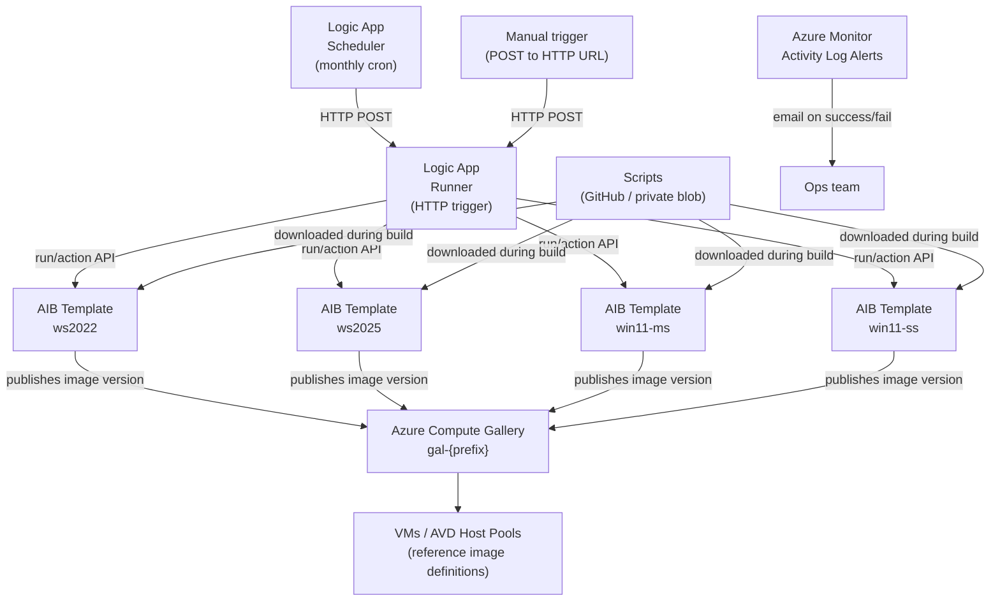

# Golden Image Builder for Azure

Fully automated golden image factory for Windows (Server + AVD) using **Azure Image Builder**, **Azure Compute Gallery**, and **Logic Apps** — deployable in one click.

> **Linux support** is planned. The `shared/modules/` folder is designed to be reused by a `linux/` deployment without changes.

---

## What is this?

Every time Microsoft releases Windows Updates, your VMs are at risk of running outdated base images. Manually maintaining golden images is error-prone and time-consuming. This solution automates the full lifecycle:

1. A Logic App fires on a monthly schedule (configurable, default: day 15 of each month ≈ 3 days after Patch Tuesday)
2. Azure Image Builder pulls the latest marketplace base image, runs your customization scripts, and publishes a new versioned image to an Azure Compute Gallery
3. Azure Monitor alerts notify you on success or failure via email
4. Any VM or AVD host pool can reference the gallery image definition — it always resolves to the latest version

You get a versioned, auditable, reproducible golden image pipeline with zero manual steps after initial deployment.

---

## Architecture



---

## What gets deployed

| Resource | Name pattern | Purpose |
|---|---|---|
| User-assigned MI | `uami-{prefix}-aib` | AIB identity — Contributor on RG |
| User-assigned MI | `uami-{prefix}-la` | Logic App identity — Contributor on RG |
| Azure Compute Gallery | `gal-{prefix}` | Stores and versions all golden images |
| Image definition (×4) | `imgdef-{prefix}-{os}` | One definition per enabled OS type |
| AIB Image Template (×n) | `aib-{prefix}-{os}` | Build config per enabled OS — run to produce an image version |
| Logic App | `la-{prefix}-runner` | HTTP trigger — POST to start an on-demand build cycle |
| Logic App | `la-{prefix}-scheduler` | Recurrence trigger — fires monthly on configured day/hour |
| Role assignments | (on RG) | Contributor for both UAMIs |
| Storage account *(optional)* | `st{prefix}gib` | Private script storage (if GitHub not reachable) |
| Log Analytics *(optional)* | `log-{prefix}-gib` | Centralized build log aggregation |
| Action Group *(optional)* | `ag-{prefix}-gib` | Email notification target |
| Activity Log Alerts *(optional)* | `alert-{prefix}-aib-*` | Fires on AIB success and failure |

---

## Supported OS images

| Parameter | OS | Marketplace SKU | Use case |
|---|---|---|---|
| `enableWindowsServer2022` | Windows Server 2022 | `2022-datacenter-azure-edition` | IaaS VM workloads |
| `enableWindowsServer2025` | Windows Server 2025 | `2025-datacenter-azure-edition` | IaaS VM workloads |
| `enableWindows11MultiSession` | Windows 11 Multi-Session | `win11-24h2-avd` | AVD pooled session hosts |
| `enableWindows11SingleSession` | Windows 11 Single-Session | `win11-24h2-ent` | AVD personal hosts / standard VMs |

---

## Prerequisites

Before deploying, ensure:

1. **Register the AIB resource provider** in the target subscription:
   ```bash
   az provider register --namespace Microsoft.VirtualMachineImages --wait
   az provider register --namespace Microsoft.Compute --wait
   az provider register --namespace Microsoft.KeyVault --wait
   az provider register --namespace Microsoft.Storage --wait
   ```

2. **Permissions** — the deploying identity needs at minimum:
   - `Contributor` on the target resource group
   - `User Access Administrator` on the target resource group (to create role assignments for the UAMIs)

3. **Subscription quota** — AIB uses Standard_D4s_v3 VMs during builds (4 vCPUs each). Ensure you have vCPU quota for the number of parallel builds (one per enabled OS).

---

## Deploy to Azure (one-click)

> **Note:** The Deploy to Azure button requires a compiled ARM template (`main.json`). Compile it first:
> ```bash
> az bicep build --file automations/build-golden-image/windows/main.bicep \
>                --outfile automations/build-golden-image/windows/main.json
> ```
> Commit `main.json` alongside the Bicep source. The button uses the compiled file.

[](https://portal.azure.com/#create/Microsoft.Template/uri/https%3A%2F%2Fraw.githubusercontent.com%2Fsimon-vedder%2Fbicep%2Fmain%2Fautomations%2Fbuild-golden-image%2Fwindows%2Fmain.json/createUIDefinitionUri/https%3A%2F%2Fraw.githubusercontent.com%2Fsimon-vedder%2Fbicep%2Fmain%2Fautomations%2Fbuild-golden-image%2Fwindows%2FcreateUiDefinition.json)

The portal wizard walks through:
- **Image Selection** — which OS types to build
- **Customization** — agents, security hardening, AVD optimizations
- **Schedule & Notifications** — build day/hour, email alerts
- **Networking** — optional VNet injection for private environments

---

## Manual deployment (Azure CLI)

```bash
# 1. Create a resource group
az group create \
  --name rg-golden-image-prod \
  --location westeurope

# 2. Deploy
az deployment group create \
  --resource-group rg-golden-image-prod \
  --template-file automations/build-golden-image/windows/main.bicep \
  --parameters @automations/build-golden-image/windows/main.parameters.example.json \
  --parameters namePrefix=gib-contoso-prod
```

---

## Post-deployment steps

### 1. Update scriptBaseUrl
If you forked this repo, update the `scriptBaseUrl` parameter to point to your fork's raw GitHub URL, or use `usePrivateScriptStorage: true` and upload the scripts to the deployed storage account.

### 2. Trigger your first build
The scheduler runs automatically on the configured schedule. To trigger an immediate build:

```bash
# Get the runner trigger URL from deployment outputs
TRIGGER_URL=$(az deployment group show \
  --resource-group rg-golden-image-prod \
  --name main \
  --query properties.outputs.manualTriggerUrl.value \
  --output tsv)

# Trigger a full build cycle
curl -X POST "$TRIGGER_URL"
```

Or find it in the Azure portal: **Resource Group → Deployments → main → Outputs → manualTriggerUrl**

### 3. Monitor build progress
AIB builds take 30–90 minutes depending on updates and scripts. Monitor via:

```bash
# Check status of a specific image template
az image builder show \
  --name aib-gib-contoso-prod-ws2022 \
  --resource-group rg-golden-image-prod \
  --query lastRunStatus
```

Or in the portal: **Image Template → Properties → Last run status**

### 4. Use the gallery images
After a successful build, reference the image definition in VM or AVD host pool deployments:

```bash
# Get the latest image version ID
az sig image-version list \
  --gallery-name gal-gib-contoso-prod \
  --gallery-image-definition imgdef-gib-contoso-prod-ws2022 \
  --resource-group rg-golden-image-prod \
  --query "[-1].id" --output tsv
```

In Bicep, reference the image definition directly and Azure always resolves to the latest version:

```bicep
imageReference: {
  id: resourceId('Microsoft.Compute/galleries/images', 'gal-gib-contoso-prod', 'imgdef-gib-contoso-prod-ws2022')
}
```

---

## Parameters reference

| Parameter | Type | Default | Description |
|---|---|---|---|
| `namePrefix` | string | *(required)* | 3-15 chars, lowercase. Drives all resource names. Example: `gib-contoso-prod` |
| `location` | string | RG location | Azure region |
| `enableWindowsServer2022` | bool | `true` | Enable WS2022 golden image |
| `enableWindowsServer2025` | bool | `true` | Enable WS2025 golden image |
| `enableWindows11MultiSession` | bool | `true` | Enable Win11 Multi-Session (AVD pooled) |
| `enableWindows11SingleSession` | bool | `false` | Enable Win11 Single-Session (AVD personal / standard VMs) |
| `installAzureMonitorAgent` | bool | `true` | Pre-install Azure Monitor Agent |
| `installDefenderForEndpoint` | bool | `true` | Configure MDE prerequisites |
| `enableSecurityHardening` | bool | `false` | CIS-aligned registry/service hardening |
| `enableAvdOptimizations` | bool | `true` | FSLogix + Teams + OS tuning (Win11 only) |
| `scriptBaseUrl` | string | this repo | Base URL for PowerShell scripts |
| `usePrivateScriptStorage` | bool | `false` | Deploy private blob storage for scripts |
| `buildScheduleDayOfMonth` | int | `15` | Day of month for scheduled builds (1-28) |
| `buildScheduleHour` | int | `2` | Hour UTC for scheduled builds (0-23) |
| `notificationEmail` | string | `""` | Email for success/failure alerts |
| `enableLogAnalytics` | bool | `false` | Deploy Log Analytics workspace |
| `useVNetInjection` | bool | `false` | Inject AIB build VM into customer VNet |
| `vnetResourceGroupName` | string | `""` | VNet resource group (if VNet injection enabled) |
| `vnetName` | string | `""` | VNet name (if VNet injection enabled) |
| `subnetName` | string | `""` | Subnet name (if VNet injection enabled) |
| `additionalReplicationRegions` | array | `[]` | Extra regions to replicate image versions |

---

## Customization scripts

Scripts live in `windows/scripts/`. They run in order during the AIB build:

| Script | Always runs | Description |
|---|---|---|
| `windows-updates.ps1` | Yes | Installs all non-preview Windows Updates via PSWindowsUpdate |
| `install-agents.ps1` | If agents enabled | Installs AMA; configures MDE prerequisites |
| `security-hardening.ps1` | If hardening enabled | Registry hardening, disables legacy TLS/SMBv1, enables firewall |
| `avd-optimizations.ps1` | If AVD opts + Win11 | FSLogix, Teams AVD mode, scheduled task cleanup, OS tuning |

To add custom scripts: add a PowerShell file to `windows/scripts/` and add a customization step in `windows/modules/imageTemplate.bicep`.

---

## Module structure

```
build-golden-image/
├── shared/modules/             # OS-agnostic modules (reused by linux/ in future)
│   ├── identity.bicep          # User-assigned managed identities (AIB + Logic App)
│   ├── gallery.bicep           # Azure Compute Gallery + image definitions
│   ├── logicapp.bicep          # Runner (HTTP) + Scheduler (recurrence) Logic Apps
│   ├── storage.bicep           # Optional private script storage
│   └── monitoring.bicep        # Optional Log Analytics + activity log alerts
└── windows/
    ├── main.bicep               # Orchestrator — wires all modules together
    ├── createUiDefinition.json  # Azure portal deployment wizard
    ├── main.parameters.example.json
    ├── modules/
    │   └── imageTemplate.bicep  # AIB template (deployed once per enabled OS)
    └── scripts/
        ├── windows-updates.ps1
        ├── install-agents.ps1
        ├── avd-optimizations.ps1
        └── security-hardening.ps1
```

---

## Known limitations

- **MDE full onboarding** requires an org-specific onboarding package applied post-deployment via Intune, Defender portal, or Group Policy. The `install-agents.ps1` script pre-stages prerequisites only.
- **Print Spooler** is disabled by `security-hardening.ps1`. Re-enable it in the script if the image type requires printing.
- **Logic App manual trigger URL** contains a SAS token valid for ~90 days. After expiry, retrieve a new URL from the portal (Logic App → Triggers → manual → Get URL) or redeploy.
- **Role assignments** use `Contributor` on the resource group. For production environments, scope these down to custom roles with least privilege.
- **Build VM size** is `Standard_D4s_v3`. Ensure quota is available. Change in `imageTemplate.bicep` if needed.
